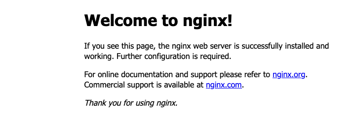

From your bash terminal, run an NGINX container and expose it at port 8080
```shell
docker container run -p 8080:80 -d nginx 
```
test it:
Find the public IP of the EC2instance that runs your cloud9  
An easier way may be to run the following
```shell
myip="$(dig +short myip.opendns.com @resolver1.opendns.com)"
echo "My WAN/Public IP address: ${myip}"
```

In the Security Group for that EC2 instance, open port 8080 (from "your IP", not from the world)
Browse to it
  

Find the container-ID of that container  
```shell
docker ps 
```
Run an Alpine container
```shell
docker run -d alpine
docker ps
```

Why don't you see the Alpine container?  
try `docker ps -a`
```shell
docker ps -a
```
Can you explain what happened?

Find the images on your host
```shell
docker image ls
```

Stop and delete all running containers
```shell
docker ps
docker stop [CONTAINER-ID]
docker rm [CONTAINER-ID] [CONTAINER-ID] [CONTAINER-ID] 
```
Delete all local images
```shell
docker image ls
docker rmi [IMAGE-ID] [IMAGE-ID] [IMAGE-ID]
```
