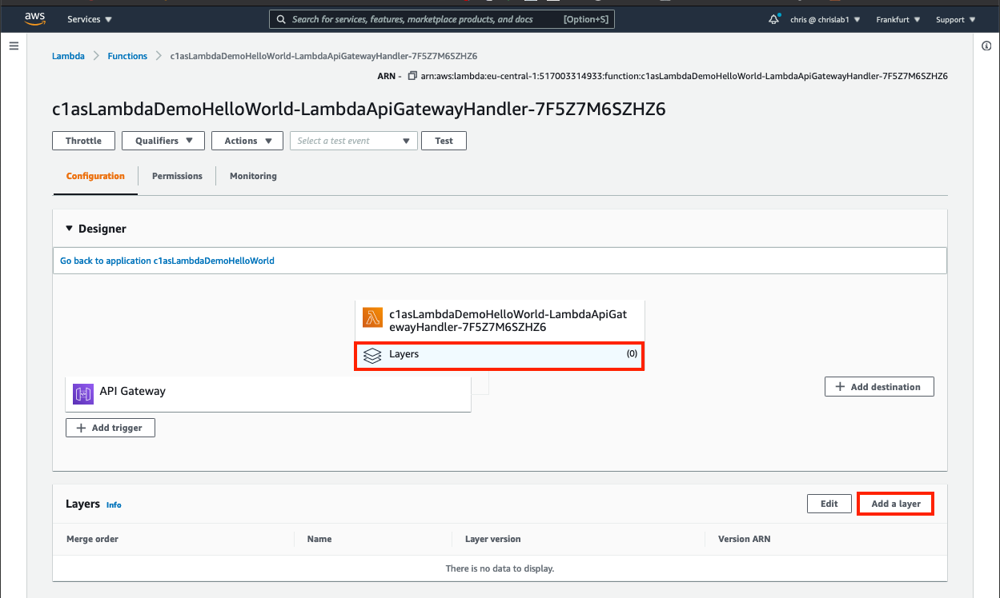
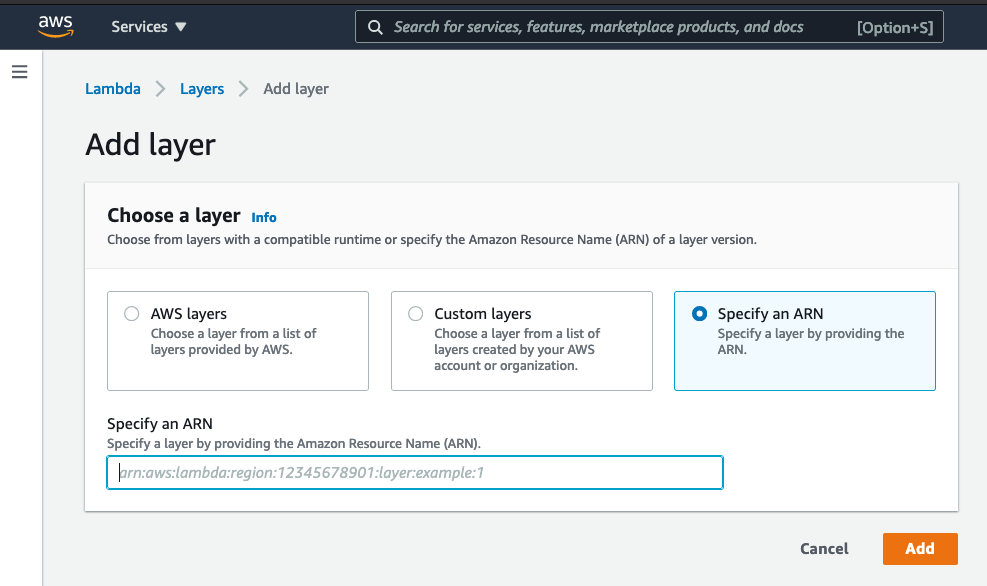
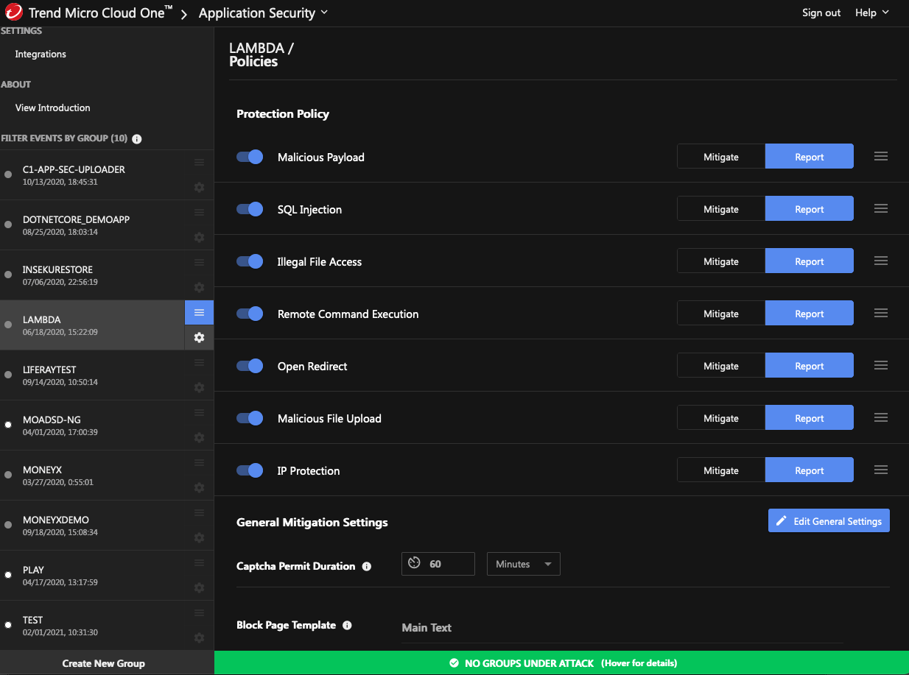

# DEPLOY A LAMBDA FUNCTION AND ENABLE CLOUDONE RUNTIME PROTECTION

## High level overview of steps (see detailed steps in next section)
1. Clone this repo
2. In C1AS, create a new group for the lambda function
3. Update the values for TREND_AP_KEY and TREND_AP_SECRET in `c1asLambdaDemoHelloWorld.yml`
4. Deploy the updated `c1asLambdaDemoHelloWorld.yml` CloudFormation stack 
5. Add Layer with C1AS microAgent


## Detailed setup steps

1. Clone this repo  (if not already done so)
cd to your projects directory 
```shell
git clone https://github.com/cvdabbeele/c1SeTrain.git
cd c1SeTrain
```

2. In C1AS, create a new group for the lambda function  
Browse to https://cloudone.trendmicro.com and login  
Select Application Security
In the left margin, and at the bottom, click `Create New Group`  
This will create a new `Key` and a `Secret`

3. Update the CloudFormationTemplate  
Copy the sample file c1asLambdaDemoHelloWorld.yml.sample to your real Cloud Formation Template file c1asLambdaDemoHelloWorld.yml  
```shell
cp c1asLambdaDemoHelloWorld.yml.sample c1asLambdaDemoHelloWorld.yml
```  
Edit `c1asLambdaDemoHelloWorld.yml` 
   and substitute your values for the TREND_AP_KEY and TREND_AP_SECRET 
   
4. Deploy the `c1asLambdaDemoHelloWorld` CloudFormation stack   
Open a new browser tab and login to AWS  
In the AWS Console go to -> Services -> CloudFormation -> Create stack: with new resources
- under "Prerequisite - Prepare template", select `template is ready`
- under "Specify template", select `Upload a template file`
- click "Choose File" and browser to the c1asLambdaDemoHelloWorld.yml where you have inserted your TREND_AP_KEY and TREND_AP_SECRET
- Next
- Give the stack a name: e.g. c1asLambdaDemoHelloWorld
- Next
- check the box next to `I acknowledge that AWS CloudFormation might create IAM resources.`
-  Create Stack
- To monitor the deployment of the stack, open the `Events` tab
- When the status becomes "CREATE_COMPLETE", go to the `Outputs` tab to find the ApiGatewayInvokeURL (something like:	https://sj7c5xxxxx.execute-api.eu-central-1.amazonaws.com/release ) 
- Open that link in new tab  
You should see a webpage as in the screenshot below


5. Add layer for C1AS:  
- In the AWS Console go to Services -> Lambda and open the Lambda function you just created.  The name may be something similar to `c1asLambdaDemoHelloWorld-LambdaApiGatewayHandler-7F5Z7Mxxxxx`
- Check the current runtime  
  scroll down to "Runtime settings" and find the Runtime = Python 3.7 as indicated in the screenshot below.  
  
- add the C1AS layer  
  Scroll back up on the screen and select "Layers (0)" in the middle of the screen, under the name of your Lambda function -> click the "Add a Layer" button in the section that is below it 
    
- in the "Add Layer" screen, select the third item `Specify an ARN`  
      
- In the AWS Layers field enter the ARN, which will depend on your configuration (region and runtime)  You can find the ARN at: https://cloudone.trendmicro.com/docs/  -> Application Security -> search for "lambda python layer.  The typical format of the ARN is:  
          `arn:aws:lambda:<aws region>:800880067056:layer:CloudOne-ApplicationSecurity-runtime-<python version>:<layer version>`   
   for aws region eu-central-1 this would become:   
          `arn:aws:lambda:eu-central-1:800880067056:layer:CloudOne-ApplicationSecurity-runtime-python3_7:4`  
   Add the ARN in the field and click `Add`  

1. Set the custom runtime:  
    Scroll back up in the main screen on your Lambda function and select the function name (this will deselect the Layer)   
       
    On that page scroll down to `Runtime settings` -> Edit 
      -> In the drop-down box, select `Custom Runtime` as indicated in the screenshot below
          


7. Set the Policies:  
 In Cloud One Application Security, open the Policies of your Group object by clicking on the three horizontal lines next to it (this is sometimes called the hamburger icon) and set all policies in Report mode as indicated in the screenshot below.  
     
 
8. Your demo environment is now ready
   
9.  An API gateway has been deployed for this function.  You can find the API endpoint by clicking on `API gateway` as indicated in the screenshot below, and then expanding the `Details` header.    Keep in mind that the first time that you trigger this Lambda function, it may take a few extra seconds.  This is because AWS has to deploy a container for the function to run in.  
    
10. You can find a demo/test scenario in [howToDemo.md](howToDemoHelloWorld.md) in this repo
    
11. Tear down  
    There is no need to tear down this environment to cut costs.  Lambda functions are only billed when they run.
  


