## create a Dockerfile

In your cloud9 environment, click on the green plus in the (sub-) menu bar and open a new (empty) file
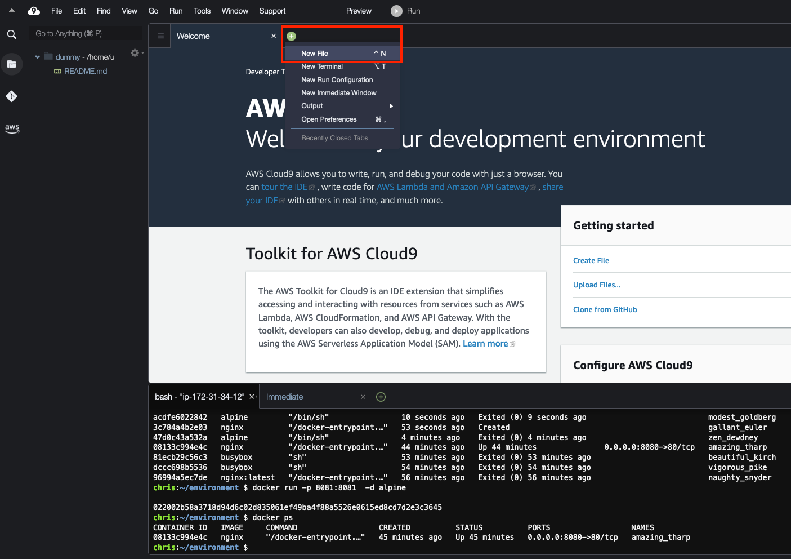

Go to https://github.com/citizen-stig/dockerdvwa/blob/master/Dockerfile and click on Raw as indicated in the screenshot below and copy the contents of that Dockerfile
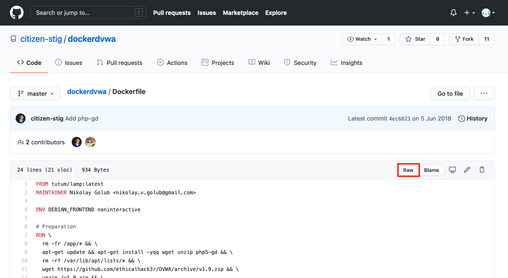

Paste that contents in your new file in Cloud9
Save the file
(-> File -> Save) and name it Dockerfile (with a capital D)
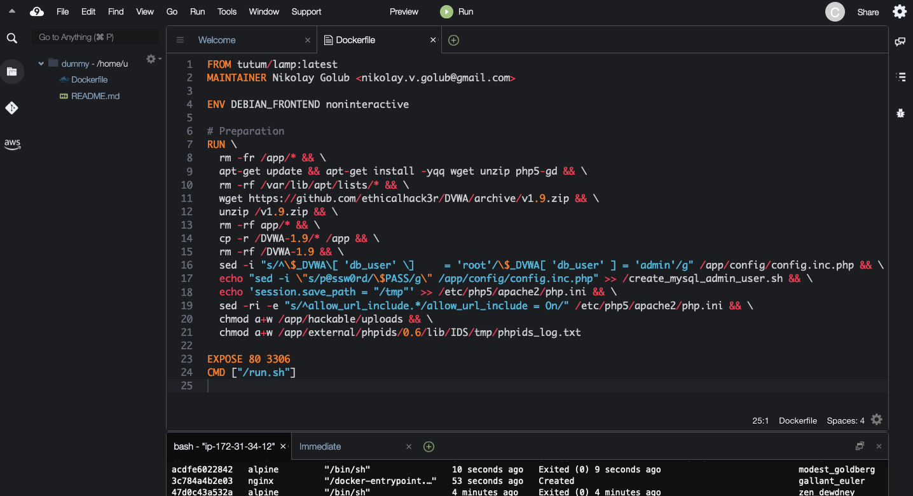

Between lines 19 and 20 add the following lines:
Mind the "\" at the end of the lines; this incicates that the RUN command from the Dockerfile continues)
`sed -ri -e "s/Damn Vulnerable/my very vulnerable/" /app/index.php && \`
`wget https://secure.eicar.org/eicar.com -O /app/logo.jpg && \`
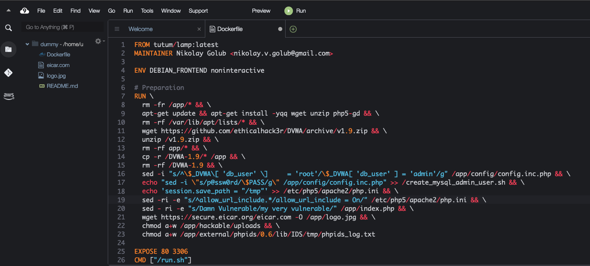

Save the file

## Build an image and tag it

The dot refers to all files in the local directory
"Dockerfile", with a capital "D" is the default name for a dockerfile
The "-t" parameter tags the image with the name "mydvwa" and version "v1"

```shell
docker build . -t mydvwa:v1
```

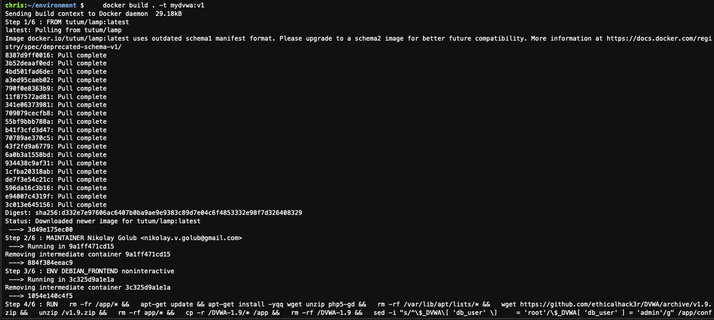

Verify if the image has been created

```shell
docker image ls
```

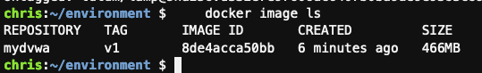

## Push the image to Dockerhub

Login to your dockerhub account

```shell
docker login
```

Retag the image for dockerhub
(replace MYDOCKERUSERNAME with your dockerhub username)

```shell
docker tag mydvwa:v1 MYDOCKERUSERNAME/mydvwa_test:v001
```

Push the image to dockerhub

```shell
docker push MYDOCKERUSERNAME/mydvwa_test:v001
```

Now tag it again, but now with the tag "latest" and push it again to dockerhub.  Please note that images with the tag "latest" are not necessarily the latest versions. They are just images with a tag "latest"

```shell
docker tag mydvwa:v1 MYDOCKERUSERNAME/mydvwa_test:latest
docker push MYDOCKERUSERNAME/mydvwa_test:latest
```

Check on dockerhub if you see your image
You may have to logout and re-login to see the new image
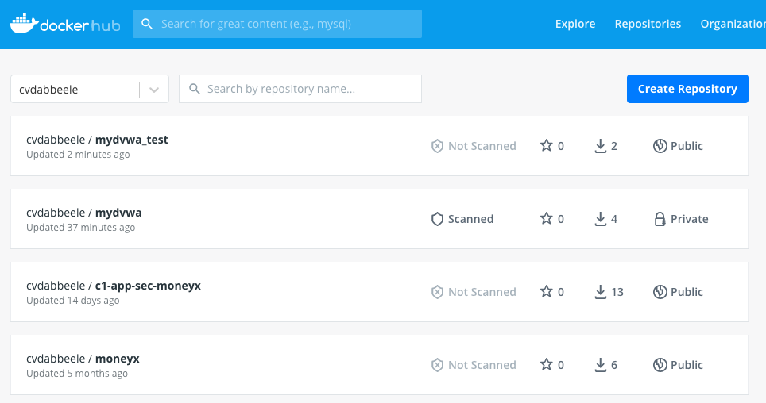

Now everyone can pull and run your image  
In the searchbar on top of the dockerhub page, you can search for all images (of the other accounts) called mydvwa.  

Run a container from it:  
```shell
docker run -d -p 8080:80 --name myDVWAlocal MYDOCKERUSERNAME/mydvwa_test:v001
```
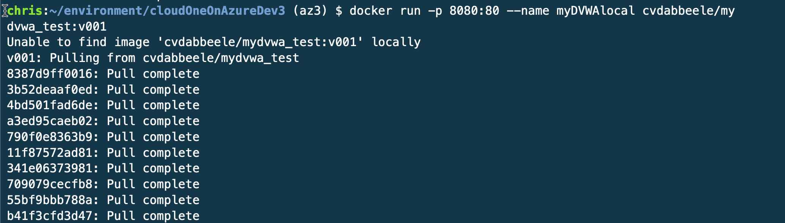
### Verify if you can see the changes that you made.  
The following requires a bit of AWS knowledge.  If you are unfamiliar with this, please let your instructor know and he can walk you through it.  
The container contains a small webserver that should be available at the IP of your cloud9 environment on port 8080

To find the public ip of your cloud 9 instance, run the following curl command:  
```bash
curl http://checkip.amazonaws.com
```

Then, to allow access to your webserver, open up port 8080 in your AWS Security groups  
AWS console (e.g. https://eu-central-1.console.aws.amazon.com/) -> ensure you are in the right region (see drop-down box at the right top of the screen) Services -> type: EC2 -> find the EC2 instance that is behind your Cloud9 and select it.   At the lower half of the screen, open the "Security" tab and under "Security Group", click on the hotlink to open the security group   
Once in the security group, select the tab "Inbound Rules" and click on the "Edit Inbound rules" box  
Add rule -> Port=8080, Source IP = MyIP as indicated below 
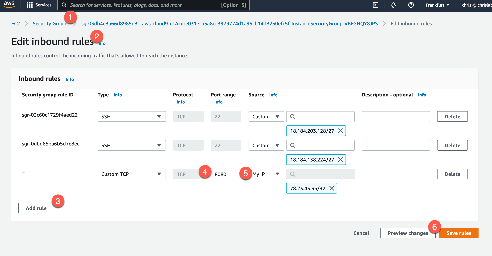

Open a browser on your workstation and go to:
`http://MY_CLOUD9_IP:8080`   MAKE SURE TO ADD HTTP://  
you should see the following:
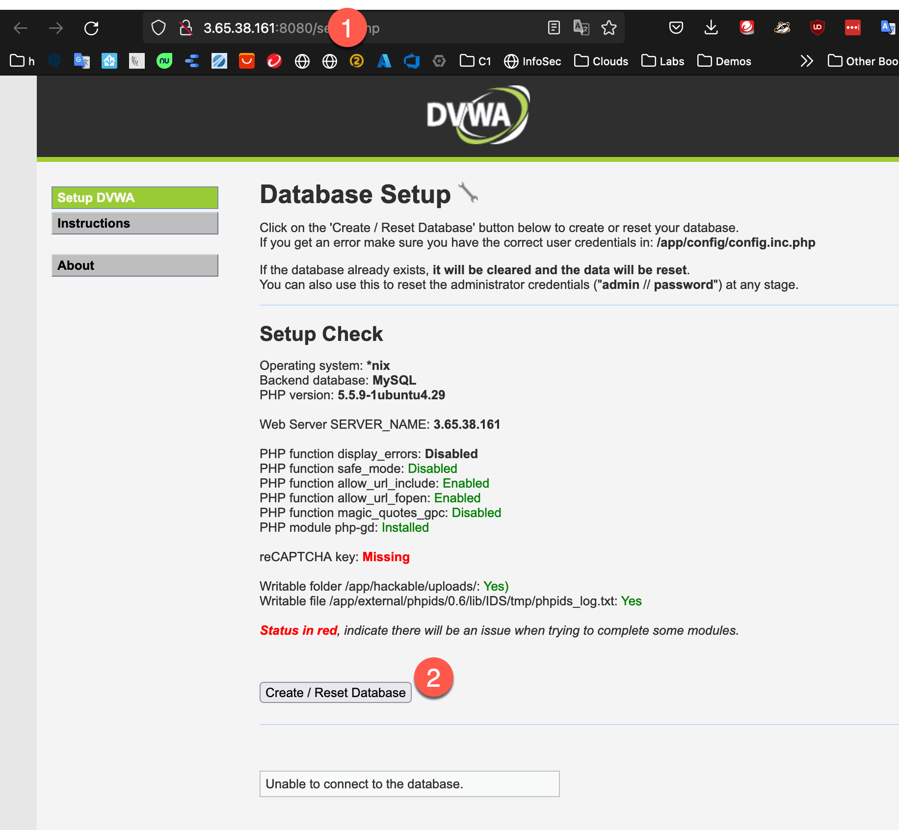
click on `Create/Reset Database` and
login with the username `admin` and password `password`
You should see your changes; being "Welcome to **my very vulnerable** Web Application!"
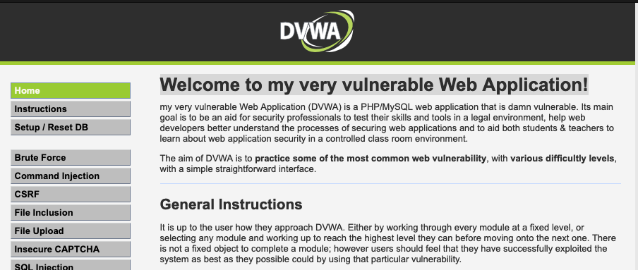

