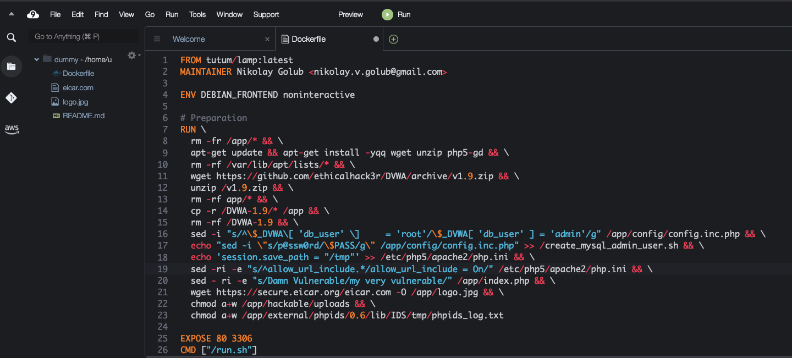

In your cloud9 environment, click on the green plus in the (sub-) menu bar and open a new file 
 

Go to https://github.com/citizen-stig/dockerdvwa/blob/master/Dockerfile ,   
click on Raw and copy the contents to your new file in Cloud9
 

Safe the file 
(-> File -> Save) and name it Dockerfile (with a capital D)
 

Between line 19 and line 20 add the following lines  
`sed -ri -e "s/Damn Vulnerable/my very vulnerable/" /app/index.php && \`
`wget https://secure.eicar.org/eicar.com -O /app/logo.jpg && \`
 

Build an image and tag it:
```shell
    docker build . -t mydvwa:v1
```


Verify if the image has been created  
```shell
    docker image ls
```


Login to your dockerhub account
```shell
docker login
```

Retag the image for dockerhub  
(replace MYDOCKERUSERNAME with your dockerhub username)
```shell
    docker tag mydvwa:v1 cvdabbeele/mydvwa_test:v001
```

Push the image to dockerhub
```shell
    docker push cvdabbeele/mydvwa_test:v001
```

Check on dockerhub if you see your image
You may have to logout and re-login


