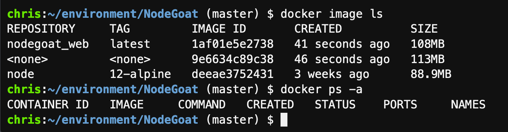

## Objectives
In this lab we will create a multi-container application.  We will use docker-compose to do that  

## Install docker-compose
From your bash terminal, run the following command:
```shell
sudo snap install docker
```

 
## Get a sample multi-container application from the internet

```shell
git clone https://github.com/OWASP/NodeGoat.git
cd NodeGoat
```

 
### Explore the docker-compose file
Open the docker-compose file in the grafical editor of cloud9


### Build the containers with one single command
The following command looks for a docker-compose.yml file in the default directory and then "builds" it.   

```shell
docker-compose build
```


Notice it says "mongo uses an image, skipping"  
As you can see in the docker-compose file under services.mongo.image, the docker-compose file will pull a ready build image directly from hub.docker.com  

However, the first part in the docker-compose file (under services.web) has a line saying `build .`  This is looking for a `Dockerfile` in the current directlry and is first building an image of it.  The other lines in that section are for running a container based on that image

Verify the effect with the following command:
```
docker image ls
docker ps -a
```


### Start the multi-container application
```
docker-compose up
```


 

### Open port 4000 to your Cloud9 environment as you did in the previous lab  

go to port 4000 of the public IP of the EC2 that hosts your Cloud9 environment and checkout the webGoat application.  
e.g. http://3.66.220.138:4000/login

